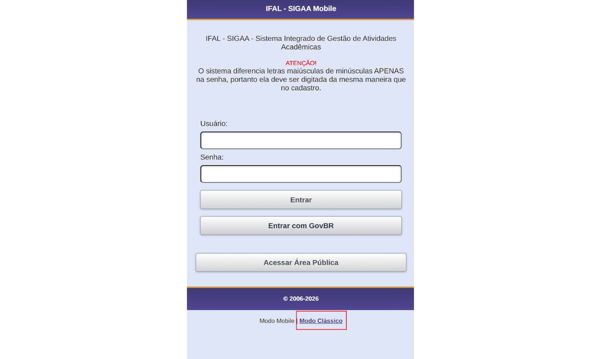
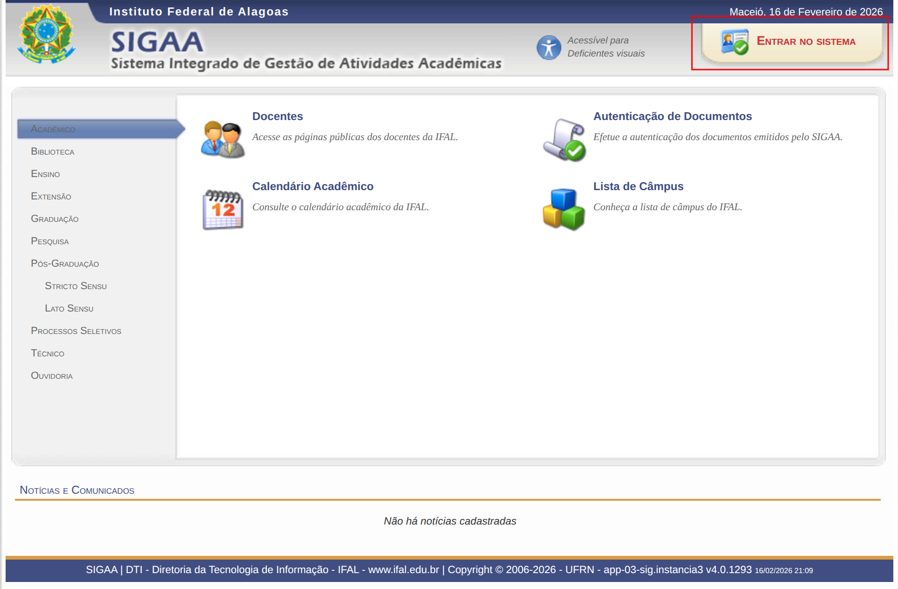
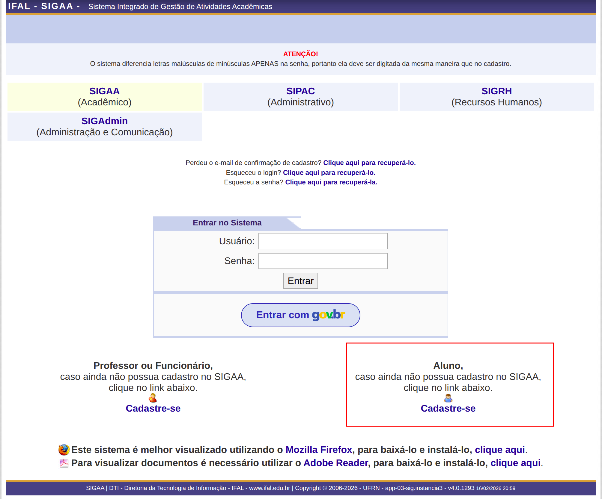
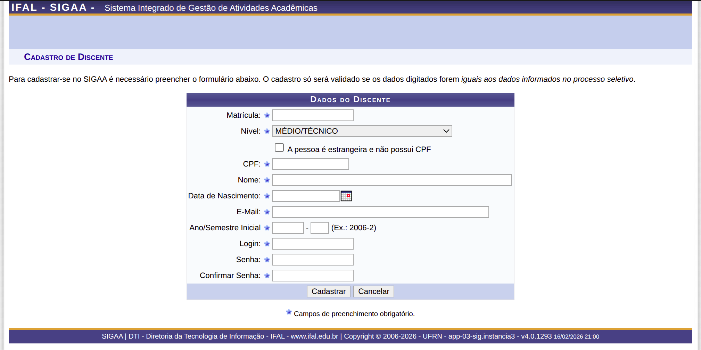
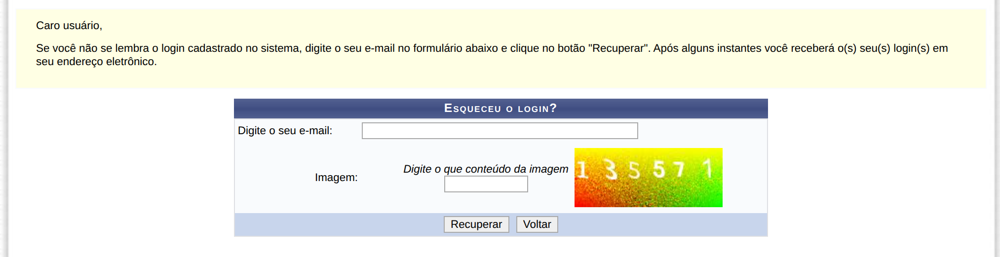
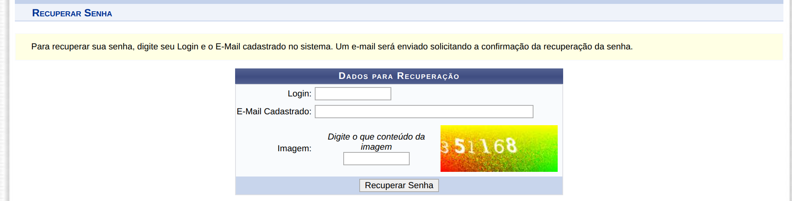

# SIGAA

O **SIGAA (Sistema Integrado de Gestão de Atividades Acadêmicas)** é o sistema acadêmico do Instituto Federal de Alagoas (IFAL). É por meio dele que você acompanha praticamente toda a sua vida acadêmica na instituição.

No SIGAA, você poderá:

- Realizar sua matrícula;
- Consultar notas e frequência;
- Acessar materiais das disciplinas;
- Enviar atividades;
- Emitir declarações acadêmicas.

Ele é a plataforma oficial de comunicação entre alunos, professores e a coordenação do curso.

Por isso, é muito importante acessar o sistema com frequência e manter seus dados atualizados. O SIGAA será seu principal aliado ao longo de toda a sua trajetória no IFAL.

---

## Acesso ao sistema

O SIGAA está disponível em:  
👉 https://sigaa.ifal.edu.br

---

## Primeiro acesso

### 1️⃣ Acessando a página inicial

- Se estiver acessando **pelo celular**, clique em **“Modo Clássico”**.

- Se estiver acessando **pelo computador**, clique em **“Entrar no sistema”**.

---

### 2️⃣ Realizando o cadastro

Clique no botão **“Cadastre-se”** (opção destinada a alunos), conforme destacado na imagem abaixo:

---

### 3️⃣ Preenchendo os dados

Preencha os dados exatamente conforme informados no ato da matrícula.

> ⚠️ **Atenção:**  
> Seu número de matrícula foi enviado automaticamente para o e-mail informado no momento da matrícula.  
> Caso não tenha recebido o e-mail, procure o **CRA (Coordenação de Registro Acadêmico)** — Bloco Administrativo, sala 08 — para:
> - Solicitar seu número de matrícula;
> - Atualizar ou corrigir seu endereço de e-mail no sistema.

No campo **Ano/Semestre inicial**, informe:

- `ANO-1` para estudantes que iniciam no **primeiro semestre**;
- `ANO-2` para estudantes que iniciam no **segundo semestre**.

Exemplo: `2026-1`.

---

### 4️⃣ Finalizando o cadastro

- Crie seu **login**;
- Defina uma **senha segura**;
- Anote suas informações para não esquecer;
- Confirme a senha;
- Clique em **“Cadastrar”**.

---

## Recuperação de acesso

Caso tenha esquecido seu **usuário** ou **senha** do SIGAA, na tela de login estão disponíveis os links de recuperação de acesso, conforme indicado na imagem abaixo:

- **1** – Recuperar login  
- **2** – Recuperar senha  

---

### 🔹 Recuperação de login (usuário)

Para recuperar seu login:

1. Digite o **e-mail cadastrado** no sistema;
2. Informe o conteúdo da **imagem de verificação**  
   *(observe que o sistema gera um novo código a cada acesso à página)*;
3. Clique para recuperar.

O sistema enviará o **login de usuário** para o e-mail informado.

> ⚠️ Caso tenha esquecido ou não tenha acesso ao e-mail cadastrado, procure o  
> **CRA (Coordenação de Registro Acadêmico)** — Bloco Administrativo, sala 08 —  
> para atualizar ou corrigir seu endereço de e-mail no sistema.

---

### 🔹 Recuperação de senha

Para recuperar sua senha:

1. Digite seu **login do SIGAA**;
2. Informe o **e-mail cadastrado**;
3. Digite o conteúdo da **imagem de verificação**  
   *(observe que o sistema gera um novo código a cada acesso à página)*;
4. Clique em recuperar senha.

O sistema enviará um **link para alteração de senha** ao e-mail cadastrado.

> ⚠️ Caso tenha esquecido ou não tenha acesso ao e-mail cadastrado, procure o  
> **CRA (Coordenação de Registro Acadêmico)** — Bloco Administrativo, sala 08 —  
> para atualizar ou corrigir seu endereço de e-mail no sistema.

