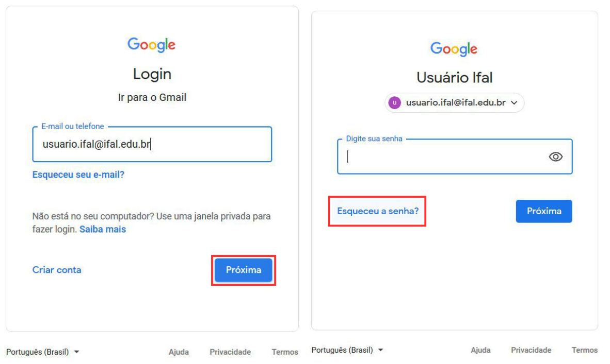
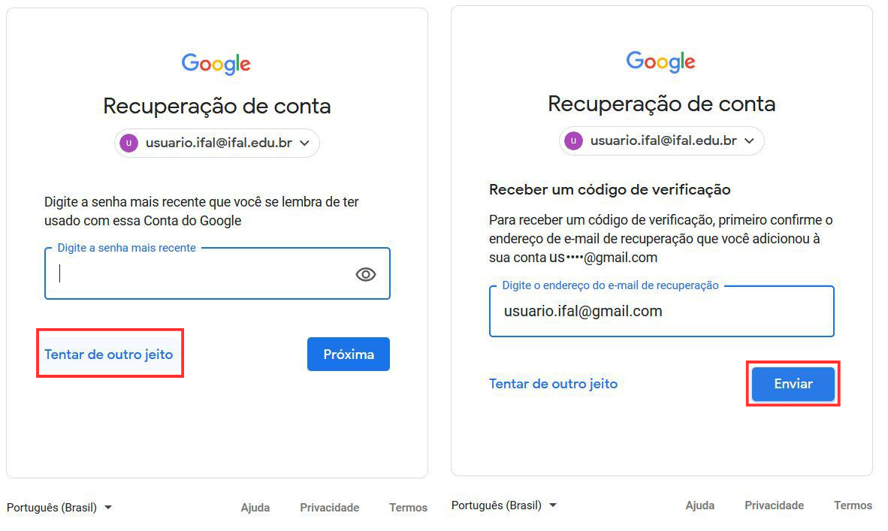
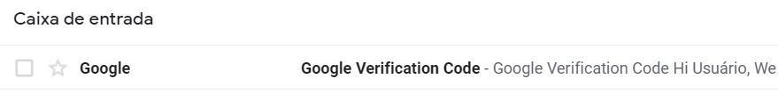
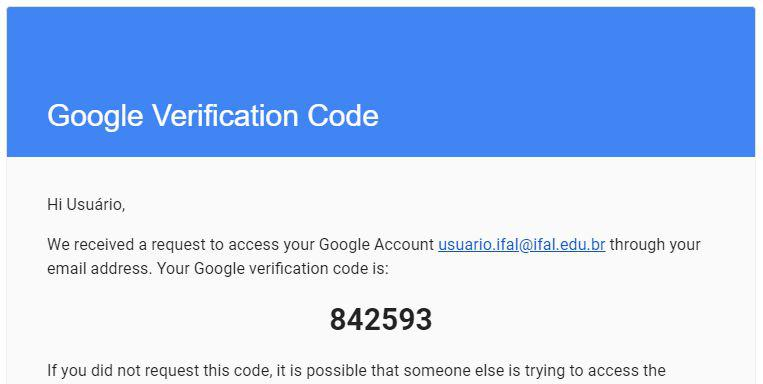
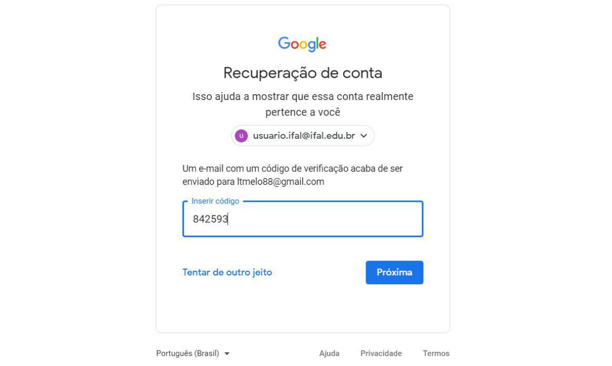
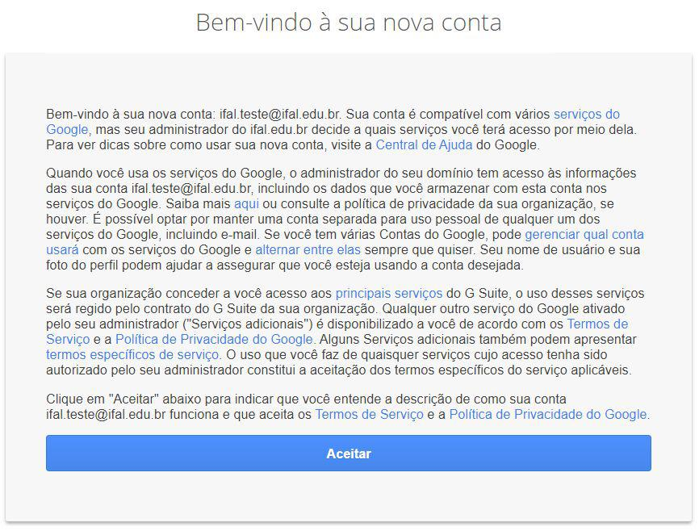

# E-mail Institucional

O e-mail institucional é o canal oficial de comunicação entre estudantes e o Instituto Federal de Alagoas (IFAL). Por meio dele, são enviados informes acadêmicos, comunicados oficiais e mensagens de docentes e setores administrativos.

A conta institucional faz parte do **Google Workspace for Education**, plataforma educacional do Google que inclui:

- Gmail  
- Google Drive  
- Google Docs, Planilhas e Apresentações  
- Google Meet  

O armazenamento é ilimitado para fins acadêmicos.

É fundamental que o estudante acesse e utilize regularmente o e-mail institucional.

---

## Como acessar o e-mail institucional

> ⚠️ **Atenção**  
> É obrigatório ter acesso ao e-mail pessoal informado no ato da matrícula, pois ele será utilizado para recuperação de senha.  
> Caso não tenha mais acesso ao e-mail pessoal cadastrado ou ele esteja incorreto, procure o **CRA (Coordenação de Registro Acadêmico)** – Bloco Administrativo, Sala 08 — para atualização dos dados.

---

Siga o passo a passo abaixo para realizar o primeiro acesso e recuperar sua senha:

---

### 1️⃣ Visualizar o e-mail institucional

Para visualizar seu e-mail, acesse:

👉 **https://emailaluno.ifal.edu.br**

Utilize o mesmo login e senha do **SIGAA** e siga as instruções exibidas na tela.

Você visualizará:

- Seu endereço de e-mail institucional  
- Seu e-mail de recuperação (e-mail pessoal cadastrado no SIGAA)

O e-mail institucional é formado pela sigla do seu nome acompanhada de um número, para diferenciar siglas semelhantes.

📌 **Anote e guarde seu e-mail institucional.**

Caso não possua acesso ao SIGAA, [acesse o guia de auto-cadastro no sistema](SIGAA) e leia-o atentamente.  
Após concluir o cadastro, aguarde o próximo ciclo de atualização, realizado toda segunda-feira.

Em caso de dúvidas, entre em contato pelo e-mail: **email@aluno.ifal.edu.br**

---

### 2️⃣ Acessar o Gmail

- Acesse: **https://www.gmail.com**
- No campo **E-mail ou telefone**, digite seu e-mail institucional
- Clique em **Próxima**
- Quando aparecer o campo de senha, clique em **Esqueceu a senha?**

- Na próxima página clique no botão **Tentar de outro jeito**
- Digite o e-mail de recuperação e clique em **Enviar**

---

### 3️⃣ Verificar o e-mail de recuperação

O código de recuperação será enviado para seu e-mail pessoal cadastrado no SIGAA.
Acesse a caixa de entrada do seu e-mail de recuperação e abra o e-mail enviado pelo Google para visualizar o código de acesso. O e-mail é semelhante ao mostrado abaixo.

Copie ou anote o código de segurança informado no e-mail.

No exemplo ilustrado, o código exibido é 842593; no entanto, **cada usuário receberá um código diferente.**

Caso não tenha mais acesso a esse e-mail, procure a **CRA (Coordenação de Registro Acadêmico) – Bloco Administrativo, Sala 08** para atualização cadastral.

---

### 4️⃣ Informar o código

- Retorne à página do Gmail
- Insira o código recebido
- Clique em **Próxima**

- Clique em **Aceitar** para concordar com os termos de uso

---

### 5️⃣ Criar nova senha

- Crie uma nova senha
- Clique em **Alterar senha**

Após esse passo, você será direcionado para a tela inicial do seu e-mail institucional.

📌 **Anote e guarde sua senha em local seguro. Não compartilhe sua senha com terceiros.**

---

Este guia foi elaborado com base no **Tutorial de Recuperação de Senha de E-mail Institucional**, produzido pela **Coordenação de Operação de Rede (CORE) / DTI** do IFAL.

O material original pode ser acessado em:
https://www2.ifal.edu.br/o-ifal/tecnologia-da-informacao/manuais/tutorial-de-recuperacao-de-senha-de-email-institucional.pdf
